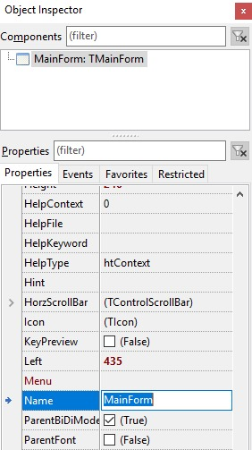

# Tiny Radio Player #01 – Introduction

In the first and several following posts, I would like to reach back into the past and check if it is still possible to successfully write applications in Pascal today. However, I'm not talking about Delphi or Turbo Pascal, but about the free Free Pascal integrated with the [Lazarus](https://www.lazarus-ide.org/) development environment. With its help, we will write, or at least try to write, an application for playing online radio stations. Lazarus is a cross-platform environment, so we assume from the start that we are writing for Windows, Linux, and Mac OSX systems. This is one of the main advantages of Lazarus. An application written for Windows can then be compiled and run on Linux or Mac OSX without any modifications.

Well, but let's consider what exactly we will need to write such a radio player. We already have the development environment. The code will be placed on [GitHub](https://github.com/kubagdynia/TinyRadioPlayer). Therefore, we still need some audio library. I suggest using [BASS](https://www.un4seen.com/). It is a free library with support for all the systems we are interested in. Additionally, it allows downloading basic information about the radio being played, recording sound to a file, and using filters such as echo or compressor. The only thing missing for complete happiness is a database. I chose [SQLite](https://www.un4seen.com/) because it is fast and stored in a single file.

## Installation

To install Lazarus on Windows, go to the downloads page and download the 32-bit version of the installer. For Linux and Mac OSX, follow a similar procedure, downloading the installer for the appropriate system.

## Adding a New Project, Initial Configuration, and Changing the IDE Language

After launching Lazarus, I suggest changing the IDE language to English since all the descriptions will be based on this version. To do this, click on **Tools -> Options**, select **Environment -> General**, and change the Language to **English [en]**. After clicking the **[OK]** button, close and restart Lazarus.

To create a new project, click **File -> New...** and choose **Project -> Application**.

Next, change the name of the main form from **Form1** to **MainForm** (Name parameter).

We also change the caption of the main form to Tiny Radio Player (**Caption** parameter), which will be displayed as the application's description. Additionally, we change the position of the main window to **poScreenCenter** (**Position** parameter). After this change, if we run the application, it will be displayed in the center of the screen.

Finally, we change the application's name to Tiny Radio Player. We can do this by going to the project options **Project -> Project Options...** and changing the **Title** parameter. From the project options screen, we can also change the application's icon. For now, let's leave it as default.

## Configuration and First Launch

To make it easier to manage the project, we will change the configuration of the directories where files will be saved during compilation.

Go to the project options **Project -> Project Options...** and navigate to the compilation options **Compiler Options**. Then, change the settings in the following way:

**Other unit files (-Fu):** *../lib/$(TargetCPU)-$(TargetOS)*
**Unit output directory (-FU):** *../compiled/$(TargetCPU)-$(TargetOS)*
**Target file name (-o):** *../bin/$(TargetCPU)-$(TargetOS)/TinyRadioPlayer*

If clicking **[OK]** displays a message about a missing directory, click **Ignore**.

Now it's time to save the project. We click **File -> Save All**. Then we create a directory named **TinyRadioPlayer** and inside it a directory named **source**. We change the file name to **TinyRadioPlayer.lpi**. We click **Save** and proceed to the next step, where we change the name of the main form file from **unit1.pas** to **MainFormUnit.pas** and click **Save** again.

The entire project is saved, so we can run it. We do this by pressing the **F9** key or from the menu by selecting **Run -> Run** or simply clicking on the Play icon.

If a message about a missing directory appears during launch, click **Create it**.

## Compilation Modes

The last thing worth doing before starting to create the application is setting the compilation modes. The default mode will be **Debug**. It will not contain any optimizations, and additionally, we will enable memory leak analysis (since there's no **garbage collector**, it's better to be safe than sorry). The second mode will be the **Release** mode, which will be optimized for production release. Moreover, in Release mode, the output file will be smaller than in Debug mode.

We go to the project compilation options **Project -> Project Options… -> Compiler Options** and click on the button with three dots next to **Build modes**.

In the newly opened window, click the button **Create Debug and Release modes**. The result of this operation should be the addition of two new modes, **Debug** and **Release**. The Default mode can be removed. If the Create Debug and Release modes button is not visible, then do it manually by changing the name of Default to Debug and adding another mode named Release.

Click the **[OK]** button and go to the **Compiler Options -> Compilation and Linking** section. Make sure that the active mode is **Debug** and change the Optimization levels to 0 (no optimization).

Switch the compilation mode to **Release** and change the **Optimization levels** to 3 (-O2 + slow optimization) (-O3), **Unit style** to Smart linkable (-CX), and **Linking** to Link smart (-XX).

Now we move to the **Compiler Options -> Debugging** section, change the compilation mode to **Debug**, and enter the settings shown below.

In **Release** mode, all options should be unchecked. Click the **[OK]** button to finish the configuration.

Let's now try out the two new compilation modes. We do this by selecting the appropriate mode:

After selecting **Debug** or **Release**, press **F9** (to run the application) or **Ctrl + F9** (to compile only). The output files (available in TinyRadioPlayer/bin/i386-win32/) currently do not differ much in size because our project is still empty. **Tip**: clicking the compilation mode gear icon will take us directly to the compilation options configuration.

## To conclude

Everything works correctly, but what kind of application example would it be if it doesn't end with displaying Hello World! To do this, press the F12 key and switch to the design view of our main form. Using the F12 key, we can toggle between the form view and the code (the same operation can be done from the menu by clicking View -> Toggle Form/Unit View). Alright, now all that's left is to select the **Standard** tab and the **TLabel** control from the controls visible at the top, then click on our form and change the **Caption** property of the TLabel control to **Hello World!**

And here is the final result.

The entire application code is available on [GitHub](https://github.com/kubagdynia/TinyRadioPlayer). Changes related only to this post can be found [here](https://github.com/kubagdynia/TinyRadioPlayer/releases/tag/01Lazarus).

Bye and see you soon…