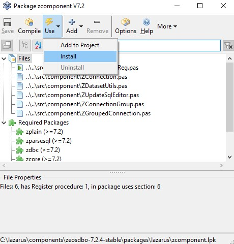
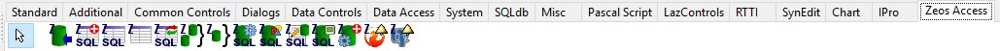

# Tiny Radio Player #02 – Component Installation

This time we will look at installing the components that will be useful in building our radio.

The installation of external components is usually a simple operation that involves downloading the appropriate package, unpacking it, and placing it in the directory:

- **Windows** – C:\lazarus\components
- **Linux** – /usr/share/lazarus/3.2/components/
The path may vary depending on the version or change of the default installation location.

We start the installation of a component by choosing **Package -> Open Package File (.lpk)** from the main menu. Then open the given package file, and in the window that appears, click **Use -> Install** and confirm the desire to install. After this operation, Lazarus will be rebuilt and the selected package will be added to the installed components.

Let's now move on to the installation of the components we need.

## Database

For database support, it is worth installing **ZeosLib** controls. This will give us the ability to connect to **MS SQL**, **Oracle**, **MySql**, **PostgreSQL** or **SQLite**, among others.

The package can be downloaded from https://sourceforge.net/projects/zeoslib, but we will use the components that I have placed in the repository in the [cmp](https://github.com/kubagdynia/TinyRadioPlayer/tree/master/cmp) directory. This way, we will eliminate the problem with different versions.

Unpack the **zeosdbo-7.2.14-stable.zip** file into the components directory, for example, C:\lazarus\components\zeosdbo-7.2.14-stable. Then, in Lazarus, from the main menu click **Package -> Open Package File (.lpk)** and select C:\lazarus\components\zeosdbo-7.2.14-stable\packages\lazarus\zcomponent.lpk. After clicking **[Open]**, the installation window will appear, click **Use -> Install**.

After clicking **Install**, you will be further informed about the installation of required packages. Click **[OK]**. Then, you will be asked if you want to rebuild Lazarus. Of course, click **[Yes]** and wait for the compilation process to finish and Lazarus to restart.

If the entire process went correctly, you should see new components in the Zeos Access tab.

## Visual Controls

Our application should primarily be functional, but at the same time, it can also look good. To make our work easier, we will install two packages: **BGRABitmap** and **BGRAControls**. The first one is used for creating and modifying images with transparency. The second is a collection of graphic controls that we will use to create our **GUI**.

### BGRABitmap

Download the package from a [link](https://github.com/bgrabitmap/bgrabitmap/releases) or from the [cmp](https://github.com/kubagdynia/TinyRadioPlayer/tree/master/cmp) directory. Copy the file bgrabitmap-11.5.8.zip to the components directory, unzip it, and proceed to installation. From the main menu in Lazarus, select **Package -> Open Package File (.lpk)** and choose C:\lazarus\components\bgrabitmap-11.5.8\bgrabitmap\bgrabitmappack.lpk or the equivalent in Linux. **BGRABitmap** does not have visual controls, so you just need to click **[Compile]**.

### BGRAControls

Download the package from a [link](https://github.com/bgrabitmap/bgracontrols/releases) or from the [cmp](https://github.com/kubagdynia/TinyRadioPlayer/tree/master/cmp) directory. Copy the file bgracontrols-8.0.zip to the components directory, unzip it, and proceed with the installation. From the main menu in Lazarus, select Package -> Open Package File (.lpk) and choose C:\lazarus\components\bgracontrols-8.0\bgracontrols.lpk or the equivalent in Linux. In the next window, click **Use -> Install**, and if you get a message about installing the BGRABitmap package, click **[OK]**. In the following window, you will be additionally asked if you want to rebuild Lazarus, click **[Yes]**.

If the process was successful, you should see new components in the BGRA Controls tab.

## Radio Station List

To display the list of radio stations, we will use **VirtualTreeView**. Its main advantage is primarily speed. Loading a million nodes takes about 700 milliseconds. VirtualTreeView uses the **LCL Extensions** package, so we start the installation with it.

### LCL Extensions

Download the package from a [link](https://github.com/blikblum/VirtualTreeView-Lazarus/releases) or from the [cmp](https://github.com/kubagdynia/TinyRadioPlayer/tree/master/cmp) directory. Copy the file **lclextensions-0.6.2.zip** to the components directory, unzip it, and proceed with the installation. From the main menu in Lazarus, we select **Package -> Open Package File (.lpk)** and choose C:\lazarus\components\lclextensions-0.6.2\lclextensions_package.lpk or the equivalent in Linux. In the next window, click **[Compile]**.

### VirtualTreeView

Download the package from a [link](https://github.com/blikblum/VirtualTreeView-Lazarus/releases) or from the [cmp](https://github.com/kubagdynia/TinyRadioPlayer/tree/master/cmp) directory. Copy the file **virtualtreeview-5.5.3-R2.zip** to the components directory, unzip it, and proceed with the installation by selecting the file C:\lazarus\components\virtualtreeview-5.5.3-R2\virtualtreeview_package.lpk or the equivalent in Linux. In the next window, click **Use -> Install**. You will be additionally informed about the installation of the LCL Extensions package. After recompiling Lazarus, new components will appear in the **Virtual Controls** tab.

That's all for today. In the next episode, we will deal with the bass library and maybe finally write a few lines of code 🙂