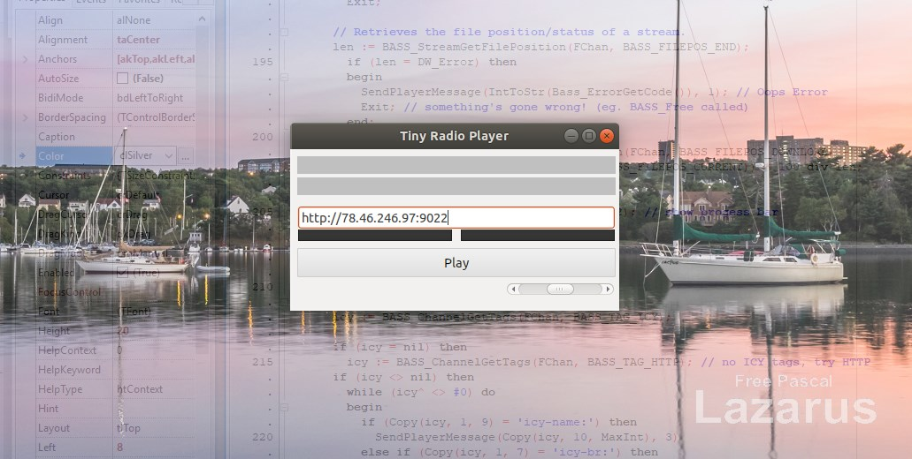
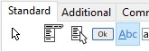
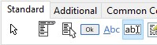
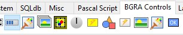
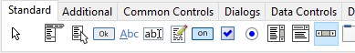
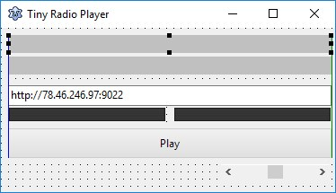
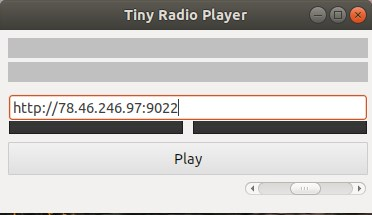

# Tiny Radio Player #03 – Work-in-progress version of the application interface

It took me some time to dig through documentation, forums, and blogs to come up with a solution that matched what I had in mind when starting this project. I particularly aimed for the ability to simply compile the project after downloading the source from GitHub and run it on Windows, Linux, and Mac OS X. Unfortunately, I don't have access to a Mac, so I want to note upfront that I'm unable to verify whether the application compiles correctly for that platform. However, I'm writing it in a way that gives it a good chance. Another thing I aimed for was to add a gradual transition effect when switching stations, smoothly transitioning between the current station and the one we want to switch to. Without further ado, today we will focus on the working application interface, and in the next post, we will integrate it with the radio station playback engine.

## Application Interface

I should say that we will work on creating a test **GUI** that will allow us to further test and develop the application. This won't be the final appearance, just the minimum we need to move forward.

First, we switch to the view of our main form (press **F12**) and then place several necessary controls on it.

At the very top, we place two **TLabel** controls, which will be used to display the song name and the station. We name them *lblInfo1* and *lblInfo2* respectively (*Name* property). Then, we remove the text from the *Caption* property, uncheck *AutoSize*, and select *akRight* in *Anchors*, so that the size of the controls automatically adjusts to the window size. Additionally, we increase the *Height* to 20, set the color to *clSilver*, *Transparent* to false, and change the *Alignment* to *taCenter*.

Below, we place a **TEdit** control that will be useful for entering the station address. We change the control's name to *edtStreamUrl*, set *Text* to e.g. http://stream3.nadaje.com:9022 (Malbork radio), and as before, we select *akRight* in *Anchors*.

Next, we place two **TBGRAFlashProgressBar** controls from the **BGRA Controls** tab. With their help, we will be able to present the sound level on the left and right channels. We name them pbLeftLevelMeter and pbRightLevelMeter. We set MinValue to 0, MaxValue to 100, and the current position Value to 0. We change the BarColor of pbLeftLevelMeter to clLime.

Slightly lower we place the **[Play]** button, which will allow us to start playing the station. However, we won't use a standard button and instead choose the  **TBCButton** available on the **BGRA Button Controls** tab. Its advantage is the ability to change appearance. To do this, right-click on the button and select "**Assign style**"; I chose the google-search style. We change the button's name to btnPlay, Caption to Play, and select akRight in Anchors.

Finally, at the very bottom, we place a **TScrollBar** (from the Standard tab), which will be used to adjust the volume of the station being played. We rename it to *sbVolume*, set *Min* to 0, and *Max* to 100. We leave only *akRight* and *akTop* in *Anchors*.

And that's it. The test **GUI** of the application in design mode should look something like the one below.

And the running application on Ubuntu looks like this.

