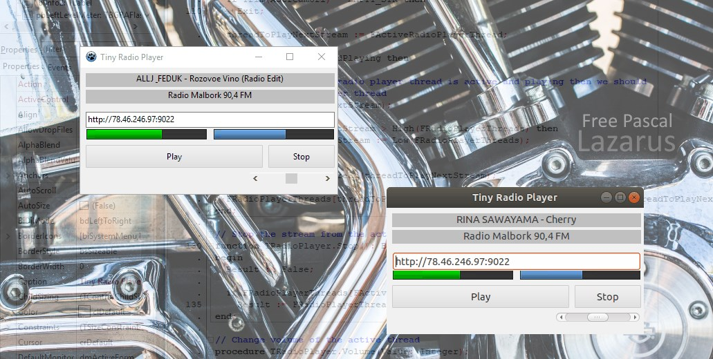

# Tiny Radio Player #04 – Building the Engine

Today, we will build an engine that will be responsible for playing Internet radio stations.. This approach will allow to group all the components of the player in one place and separate it from the rest of the application. It will also make it possible, for example, to directly connect the engine to a console application.

## Assumptions

Every launch or station switch will create a new thread (from a specified pool). Its task will be to try to establish a connection with the server and load the initial data. If the operation is successful, there will be a smooth transition from playing one station to another. After a complete switchover, all inactive threads will be stopped and deleted.

## Bass Library

For playback, we will use the **Bass** library. It can be downloaded from the www.un4seen.com. From the downloaded archive, we only need the library file. After extracting, we place it in the appropriate directory:

- Windows – place the **bass.dll** file in *TinyRadioPlayer\bin\i386-win32\data\lib*
- Linux – place the **libbass.so** file in *TinyRadioPlayer/bin/x86_64-linux/data/lib*
- Mac OSX – place the **libbass.dylib** file in *TinyRadioPlayer/bin/i386-darwin/data/lib*

Given that the Bass library should be dynamically loaded in Free Pascal, instead of using the **bass.pas** file available in the compressed archive, we will use [lazdynamic_bass.pas](https://github.com/kubagdynia/TinyRadioPlayer/blob/master/sources/lazdynamic_bass.pas). This way, we will be able to dynamically load the library file and then, upon closing the application, unload it from memory. After downloading, we place it in the application's sources.

## Multithreading and Memory Management

In the Linux and Mac OSX systems, to create multithreaded applications, we must use the **cthreads** module. It should be added as the first module of the project in the **TinyRadioPlayer.lpr file**.

```pascal
program TinyRadioPlayer;
 
{$mode objfpc}{$H+}
 
uses
  {$IFDEF UNIX}{$IFDEF UseCThreads}
  cthreads,
  cmem, // the c memory manager is on some systems much faster for multi-threading
  {$ENDIF}{$ENDIF}
  {$IFDEF DEBUG}
  // You can not use the -gh switch with the cmem unit.
  // The -gh switch uses the heaptrc unit, which extends the heap manager.
  // Therefore the heaptrc unit must be used after the cmem unit.
  heaptrc,
  {$ENDIF}
  Interfaces, // this includes the LCL widgetset
```

Additionally, to optimize the memory management process, we add the **cmem** module. Unfortunately, this change requires disabling memory leak analysis in the **Debug** mode settings. To do this, open the project settings Project -> Project Options… -> Compiler Options -> Debugging and uncheck Use Heaptrc unit (check for mem-leaks) (-gh). Implement these changes only for **Debug** mode.

Finally, it remains only to add compiler directives, namely UseCThreads and DEBUG. Open Project -> Project Options… -> Compiler Options -> Custom Options and for **Debug** mode add -dUseCThreads and -dDEBUG, and for **Release** add -dUseCThreads and -dRELEASE.


## Custom Thread Class

We will name the new class [TRadioPlayerThread](https://github.com/kubagdynia/TinyRadioPlayer/blob/master/sources/radioplayerthread.pas) and create it as an extension of the **TThread** class.

```pascal
TRadioPlayerThread = class(TThread)
private
  FActive: boolean;
  FThreadIndex: integer;
  FChannel: HSTREAM;
  FVolume: integer;  // main volume
  FReq: DWord;
  FCritSection: TCriticalSection;
  FChannelStatus: DWord;
  FStreamUrlToPlay: string;
 
  FPlayerMessage: string;
  FPlayerMessageType: TPlayerMessageType;
 
  // floating-point channel support? 0 = no, else yes
  FFloatable: DWord;
 
  // Custom events
  FOnStreamPlaying: TStreamStatusEvent;
  FOnStreamStopped: TNotifyEvent;
  FOnStreamPaused: TNotifyEvent;
  FOnStreamStalled: TNotifyEvent;
  FOnStreamGetTags: TStreamGetTagsEvent;
 
  procedure DoFadeIn(time: integer = 1000);
  procedure DoFadeOut(time: integer = 200);
 
  procedure OpenURL(url: PChar);
  procedure StreamStop;
  procedure MetaStream;
  procedure SendPlayerMessage(AMessage: string; AMessageType: TPlayerMessageType);
  procedure CheckBufferProgress;
protected
  procedure Execute; override;
  procedure SynchronizePlayerMessage;
  procedure SynchronizeOnStreamPlaying;
  procedure SynchronizeOnStreamStopped;
  procedure SynchronizeOnStreamPaused;
  procedure SynchronizeOnStreamStalled;
public
  constructor Create(CreateSuspended : boolean; Floatable: DWord = 0);
  destructor Destroy; override;
 
  function ErrorGetCode: Integer;
  function ChannelGetLevel: DWORD;
  function StreamGetFilePosition(mode: DWORD): QWORD;
  function ChannelIsActiveAndPlaying: Boolean;
  function ChannelIsActiveAndPaused: Boolean;
  function ChannelIsActiveAndStopped: Boolean;
  function ChannelIsActiveAndStalled: Boolean;
  function Pause: Boolean;
  function Stop: Boolean;
  function ChangeVolume(Value: Integer): Boolean;
  procedure PlayURL(AStreamUrl: string;
    const AVolume: Integer; const AThreadIndex: Integer);
 
  property OnStreamPlaying: TStreamStatusEvent read FOnStreamPlaying write FOnStreamPlaying;
  property OnStreamStopped: TNotifyEvent read FOnStreamStopped write FOnStreamStopped;
  property OnStreamPaused: TNotifyEvent read FOnStreamPaused write FOnStreamPaused;
  property OnStreamStalled: TNotifyEvent read FOnStreamStalled write FOnStreamStalled;
  property OnStreamGetTags: TStreamGetTagsEvent read FOnStreamGetTags write FOnStreamGetTags;
  property Active: boolean read FActive;
end;
```

Implementation and description of all methods can be found in the repository on [GitHub](https://github.com/kubagdynia/TinyRadioPlayer/blob/master/sources/radioplayerthread.pas). At this point, I would only like to present the general principles. After creating the thread, we start waiting for the URL of the station to be passed. If one appears, we try to open it. Then, during playback, we retrieve information provided by the station. We pass each type of information with the help of attached events. We also inform about the start, end, and suspension of playback. If a different URL is specified, the currently playing station will be muted, and an attempt will be made to start another station and gradually increase the volume..

## Thread Management

For thread management, we will create a separate class named [TRadioPlayer](https://github.com/kubagdynia/TinyRadioPlayer/blob/master/sources/radioplayer.pas). Internally, it will handle the creation, switching, and deletion of threads, as well as the initialization of the bass library and its extensions. Externally, methods for managing playback will be exposed. It will be our external engine interface.

```pascal
TRadioPlayer = Class(TObject)
private
  FActiveRadioPlayerThread: integer;
  FRadioPlayerThreads: array [1..MAX_PLAYER_THREADS] of TRadioPlayerThread;
  FFloatable: DWord;
  FThreadWatcher: TTimer;
  FOnRadioPlayerTags: TRadioPlayerTagsEvent;
  FOnRadioPlay: TNotifyEvent;
  procedure Error(msg: string);
  procedure RadioInit;
  function LoadBassPlugins: Boolean;
  procedure RadioPlayerThreadsOnStreamPlaying(ASender: TObject; AThreadIndex: integer);
  procedure RadioPlayerThreadsStreamGetTags(ASender: TObject; AMessage:
    string; APlayerMessageType: TPlayerMessageType);
  procedure ThreadWatcherTimer(Sender: TObject);
  procedure TerminateThread(ThreadIndex: Integer; TerminateIfNotActive: Boolean);
  procedure CreateAndLaunchNewThread(ThreadIndex: Integer);
public
  constructor Create; overload;
  destructor Destroy; override;
 
  procedure PlayURL(const AStreamUrl: string; const AVolume: ShortInt);
 
  function Stop(): Boolean;
  procedure Volume(Value: Integer);
 
  function ChannelIsActiveAndPlaying: Boolean;
  function ChannelGetLevel: DWORD;
  function NumberOfRunningThreads: integer;
 
  property OnRadioPlayerTags: TRadioPlayerTagsEvent
    read FOnRadioPlayerTags write FOnRadioPlayerTags;
  property OnRadioPlay: TNotifyEvent read FOnRadioPlay write FOnRadioPlay;
end;
```

We can set the maximum number of threads, **MAX_PLAYER_THREADS**, to **3**. This way, one of them will be dedicated to playback, and the remaining two (if needed) will handle establishing connections. If any of the threads reports the start of playback, we switch to it, and the other threads are stopped and removed. To test if the switching actually works, we can change the number of threads to **1** and click the **[Play]** button several times. Between each click, there should be a playback pause indicating the establishment of a connection. If we use more threads, then connection establishment and buffering occur in separate threads, which eliminates the moment of silence, replacing it with a smooth transition in playback threads.

## Connecting the Engine to the GUI

Finally, we create an instance of the engine class and connect events to the appropriate GUI elements.

```pascal
unit MainFormUnit;
 
{$mode objfpc}{$H+}
 
interface
 
uses
  Classes, SysUtils, FileUtil, BCButton, BGRAFlashProgressBar, BCLabel, Forms,
  Controls, Graphics, Dialogs, LCLType, StdCtrls, ExtCtrls, Helpers,
  RadioPlayer, RadioPlayerTypes;
 
type
 
  TMainForm = class(TForm)
    btnStop: TBCButton;
    pbLeftLevelMeter: TBGRAFlashProgressBar;
    btnPlay: TBCButton;
    edtStreamUrl: TEdit;
    lblInfo1: TLabel;
    lblInfo2: TLabel;
    pbRightLevelMeter: TBGRAFlashProgressBar;
    sbVolume: TScrollBar;
    Timer1: TTimer;
    procedure btnPlayClick(Sender: TObject);
    procedure btnStopClick(Sender: TObject);
    procedure FormCreate(Sender: TObject);
    procedure FormDestroy(Sender: TObject);
    procedure RadioPlayerRadioPlay(Sender: TObject);
    procedure RadioPlayerRadioPlayerTags(AMessage: string; APlayerMessageType: TPlayerMessageType);
    procedure sbVolumeChange(Sender: TObject);
    procedure Timer1Timer(Sender: TObject);
  private
 
  public
    RadioPlayer: TRadioPlayer;
  end;
 
var
  MainForm: TMainForm;
 
implementation
 
{$R *.lfm}
 
procedure TMainForm.btnPlayClick(Sender: TObject);
begin
  RadioPlayer.PlayURL(edtStreamUrl.Text, sbVolume.Position);
end;
 
procedure TMainForm.btnStopClick(Sender: TObject);
begin
  RadioPlayer.Stop();
end;
 
procedure TMainForm.FormCreate(Sender: TObject);
begin
  MainWindowHandle := Handle;
 
  RadioPlayer := TRadioPlayer.Create;
  RadioPlayer.OnRadioPlayerTags := @RadioPlayerRadioPlayerTags;
  RadioPlayer.OnRadioPlay := @RadioPlayerRadioPlay;
end;
 
procedure TMainForm.FormDestroy(Sender: TObject);
begin
  FreeAndNil(RadioPlayer);
end;
 
procedure TMainForm.RadioPlayerRadioPlay(Sender: TObject);
begin
 
end;
 
procedure TMainForm.RadioPlayerRadioPlayerTags(AMessage: string;
  APlayerMessageType: TPlayerMessageType);
begin
  case APlayerMessageType of
    Connecting: begin
      lblInfo1.Caption := 'Connecting';
    end;
    Error: begin
      lblInfo1.Caption := 'Idle: ' + AMessage;
    end;
    Progress: begin
      // Buffering progress
    end;
    StreamName: begin
      lblInfo2.Caption := AMessage;
    end;
    Bitrate: begin
      // bitrate
    end;
    StreamTitle: begin
      // title name, song name
      lblInfo1.Caption := AMessage;
    end;
    Other: begin
      lblInfo2.Caption := AMessage;
    end;
  end;
end;
 
procedure TMainForm.sbVolumeChange(Sender: TObject);
begin
  RadioPlayer.Volume(sbVolume.Position);
end;
 
procedure TMainForm.Timer1Timer(Sender: TObject);
var
  level: DWORD;
begin
 
  if RadioPlayer.ChannelIsActiveAndPlaying then
  begin
    level := RadioPlayer.ChannelGetLevel;
 
    pbLeftLevelMeter.Value := MulDiv(100, LoWord(level), 32768);
    pbRightLevelMeter.Value := MulDiv(100, HiWord(level), 32768);
  end else if (pbLeftLevelMeter.Value <> 0) or (pbRightLevelMeter.Value <> 0) then
  begin
    pbLeftLevelMeter.Value := 0;
    pbRightLevelMeter.Value := 0;
  end;
end;
 
end.
```

Additionally, on the main form, we place a **Timer** that, every 33 milliseconds, will retrieve information about the sound level and display it on progress bars.

And that's all for today. The entire application code is available on [GitHub](https://github.com/kubagdynia/TinyRadioPlayer), and the changes related to this post can be found [here](https://github.com/kubagdynia/TinyRadioPlayer/releases/tag/0.1.4). You can use http://stream3.nadaje.com:9022 instead of http://78.46.246.97:9022.

