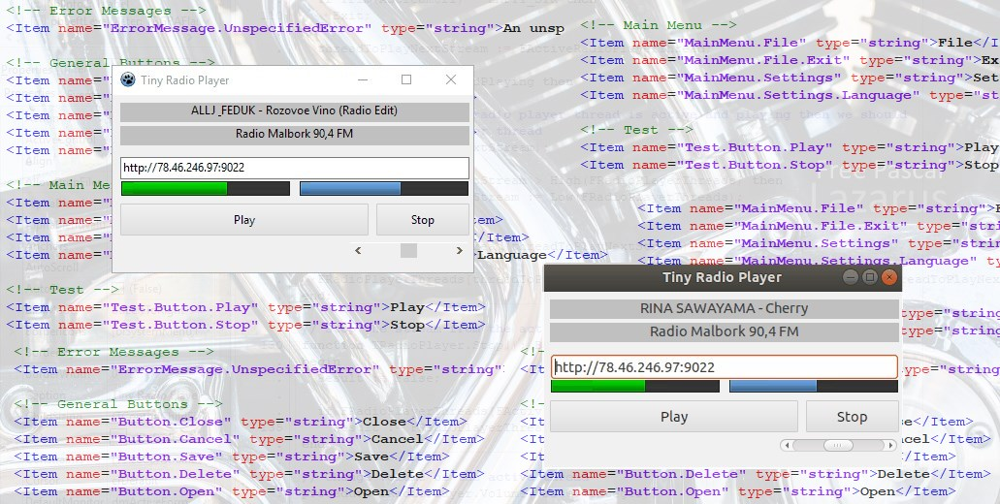

# Tiny Radio Player #05 – Save application settings

## Settings

We will save the application settings to disk as an XML file. This method will allow us easy access to edit the configuration in any text editor. If the settings file is not found upon launching the application, it will be created with default values and saved in the application's main directory.

The shortened version of the XML file looks as follows:

```xml
<?xml version="1.0" encoding="UTF-8"?>
<Settings>
  <Item name="Volume">100</Item>
</Settings>
```

The name of the item is arbitrary and depends only on us. However, we must remember that it is by this name we will refer to the given item.

Let's now move on to discussing the class responsible for saving and reading the settings.

```pascal
unit TRPSettings;   
 
  TTRPSettings = class sealed (TObject)
  private
    // class variables and methods belongs to the class, not to the instance
 
    class var SettingsHashmap: TStringList;
    // if its true, the settings should be saved before exit
    class var IsUpdated: Boolean;
 
    class procedure CreateDefaultSettings;
    class function GetSettingsFilePath(): string;
    class procedure Initialize();
    class procedure Finalize();
  public
    // static methods
    class function GetValue(const Item: string;
      const DefaultValue: string = EMPTY_STR; const AddIfNoExists: boolean = false): string;
    class function GetValue(const Item: string;
      const DefaultValue: integer = EMPTY_INT; const AddIfNoExists: boolean = false): integer;
    class function SetValue(const Item: string; const Value: string): ErrorId;
    class function SetValue(const Item: string; const Value: integer): ErrorId;
    class procedure SaveSettings;
    class procedure LoadSettings;
  end;
 
initialization
  TTRPSettings.Initialize();
 
finalization
  TTRPSettings.Finalize();
```

All components of the class are static, so we do not create instances of this class. **Initialization** section is run once when creating Unit. So it is ideal for plugging in a method that will load the application settings.. **Finalization**, on the other hand, will allow you to save the configuration and release previously created resources.

After loading the configuration, we add all items to the **SettingsHashmap** list. To update or add a new item, we use the **SetValue** method. To retrieve a value, we use **GetValue**, where as the second parameter we can specify a default value that will be returned if the given item is not found. To eliminate the situation of saving settings that have not been changed, we use the **IsUpdated** flag. After calling the SetValue method, we set its value to True, which allows us to later determine if the configuration has been changed and should be saved to a file.

To add or retrieve an item from the configuration, we refer directly to the [TTRPSettings](https://github.com/kubagdynia/TinyRadioPlayer/blob/master/sources/trpsettings.pas) class.

```pascal
// adding or updating a value
TTRPSettings.SetValue('Volume', sbVolume.Position);
 
// retrieving a value
sbVolume.Position := TTRPSettings.GetValue('Volume', 100);
```

## Update

As part of further work on the application, the ability to group settings and save them under a given name has been added. The **SetGroupValue** and **GetGroupValue** methods available in [TTRPSettings](https://github.com/kubagdynia/TinyRadioPlayer/blob/master/sources/trpsettings.pas) are used for this.

As usual, the entire application code is available on [GitHub](https://github.com/kubagdynia/TinyRadioPlayer). The changes that are discussed in this post are available [here](https://github.com/kubagdynia/TinyRadioPlayer/releases/tag/0.1.5).

